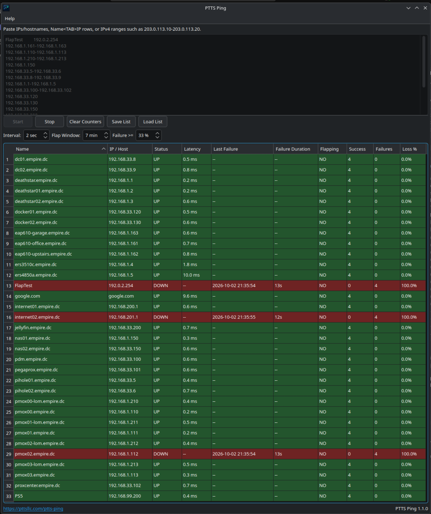
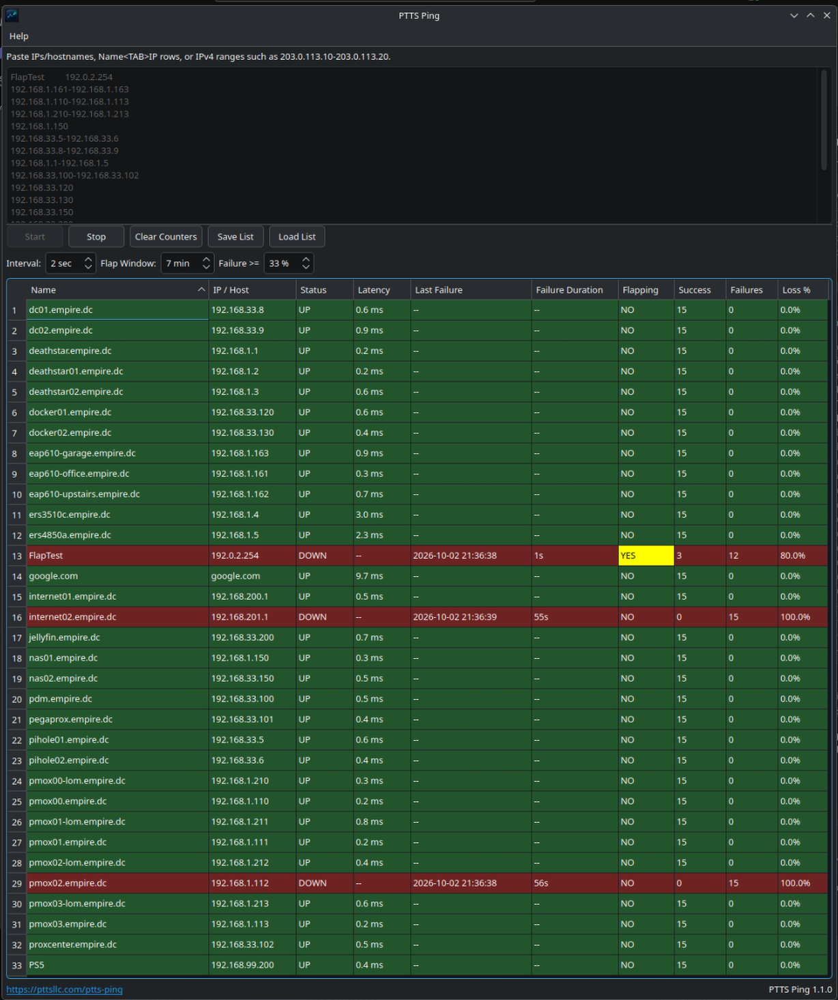
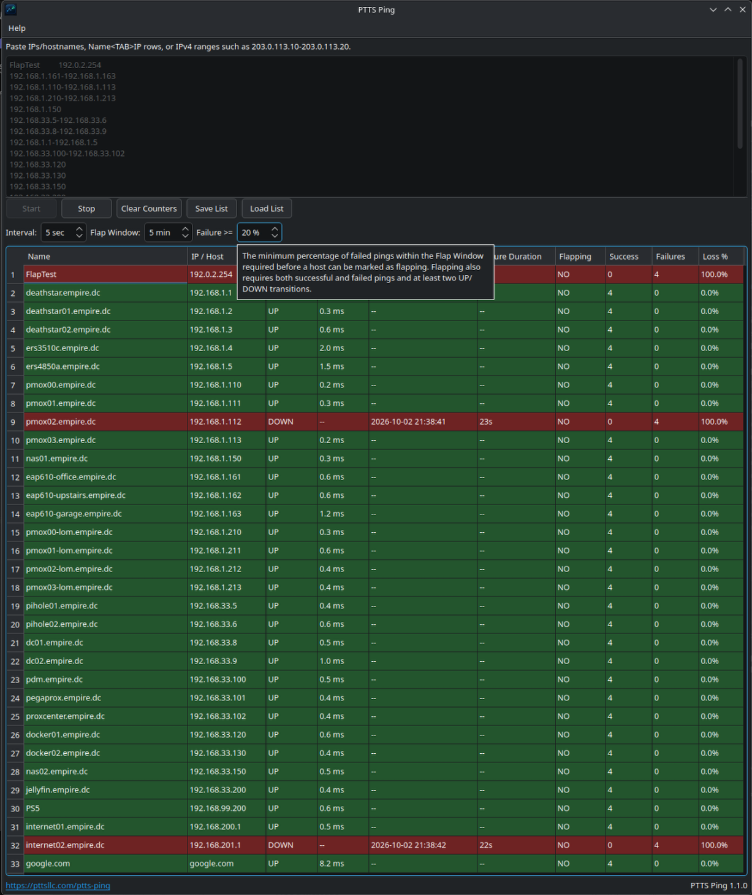

# PTTS Ping 1.3.0

**One ping monitor. Same experience everywhere.**

A focused multi-host ping monitor for Windows and supported Linux desktops.
Paste your hosts and see reachability, latency, packet loss and outages in one
window—with the same menus, controls and shareable host lists on both platforms.
**Proprietary Freeware:** free for personal, educational and internal commercial use.

## Download PTTS Ping

### Windows 10 1809+ / Windows 11 x64

**[Download Windows x64 Installer](https://github.com/nproctor-dev/PTTS-Ping-Support/releases/download/v1.3.0/ptts-ping-1.3.0-windows-x64-setup.exe)** · [SHA256](https://github.com/nproctor-dev/PTTS-Ping-Support/releases/download/v1.3.0/ptts-ping-1.3.0-windows-x64-setup.exe.sha256)

One installer supports both Windows 10 1809 or later and Windows 11.

### Ubuntu 24.04 / 26.04

**[Download .deb](https://github.com/nproctor-dev/PTTS-Ping-Support/releases/download/v1.3.0/ptts-ping_amd64.deb)** · [SHA256](https://github.com/nproctor-dev/PTTS-Ping-Support/releases/download/v1.3.0/ptts-ping_amd64.deb.sha256)

### Fedora 44

**[Download RPM](https://github.com/nproctor-dev/PTTS-Ping-Support/releases/download/v1.3.0/ptts-ping-1.3.0-1.fc44.x86_64.rpm)** · [SHA256](https://github.com/nproctor-dev/PTTS-Ping-Support/releases/download/v1.3.0/ptts-ping-1.3.0-1.fc44.x86_64.rpm.sha256)

### Fedora 43

**[Download RPM](https://github.com/nproctor-dev/PTTS-Ping-Support/releases/download/v1.3.0/ptts-ping-1.3.0-1.fc43.x86_64.rpm)** · [SHA256](https://github.com/nproctor-dev/PTTS-Ping-Support/releases/download/v1.3.0/ptts-ping-1.3.0-1.fc43.x86_64.rpm.sha256)

### Rocky Linux 10 / AlmaLinux 10

**[Download EL10 RPM](https://github.com/nproctor-dev/PTTS-Ping-Support/releases/download/v1.3.0/ptts-ping-1.3.0-1.el10.x86_64.rpm)** · [SHA256](https://github.com/nproctor-dev/PTTS-Ping-Support/releases/download/v1.3.0/ptts-ping-1.3.0-1.el10.x86_64.rpm.sha256)

### Rocky Linux 9 / AlmaLinux 9

**[Download EL9 RPM](https://github.com/nproctor-dev/PTTS-Ping-Support/releases/download/v1.3.0/ptts-ping-1.3.0-1.el9.x86_64.rpm)** · [SHA256](https://github.com/nproctor-dev/PTTS-Ping-Support/releases/download/v1.3.0/ptts-ping-1.3.0-1.el9.x86_64.rpm.sha256)

### openSUSE Leap 16.0

**[Download RPM](https://github.com/nproctor-dev/PTTS-Ping-Support/releases/download/v1.3.0/ptts-ping-1.3.0-1.lp160.x86_64.rpm)** · [SHA256](https://github.com/nproctor-dev/PTTS-Ping-Support/releases/download/v1.3.0/ptts-ping-1.3.0-1.lp160.x86_64.rpm.sha256)

**Other Linux / Debian:** [View all downloads](https://github.com/nproctor-dev/PTTS-Ping-Support/releases/tag/v1.3.0). Debian and other
unlisted distributions have not been validated. Use only a package for your system.

[Release notes](https://github.com/nproctor-dev/PTTS-Ping-Support/releases/tag/v1.3.0) · [Checksums](#checksums) · [Website](https://pttsllc.com/software/ptts-ping/) · [Support](https://github.com/nproctor-dev/PTTS-Ping-Support/issues)

## Looks at home on your desktop

PTTS Ping automatically inherits your operating system's Light/Dark appearance.
Windows 10 and Windows 11 follow live Light/Dark changes without restarting.
Native platform networking sits underneath the same desktop workflow.

No account. No server. No database. No subscription. No monitoring agent.
No cloud service is required for monitoring. Just run PTTS Ping.

Save a UTF-8 host list on Windows and load it on Linux: same format, same workflow.
**Help → Check for Updates** checks public releases only when you ask. Downloads
open in your browser; nothing is silently downloaded or installed.

## Install

**Windows:** download the Windows x64 installer, run it, then launch **PTTS Ping**
from Start. The same installer supports Windows 10 1809+ and Windows 11, includes
the runtime, and upgrades the previous installation in place. Unsigned installers
may show a Windows trust prompt.

**Ubuntu:** download the .deb, open it with your graphical software installer,
click **Install**, then launch **PTTS Ping** from your applications menu.

<details>
<summary>Prefer the terminal?</summary>

```sh
sudo apt install ./ptts-ping_amd64.deb
```

</details>

**Fedora:** download the RPM matching your version, then run its command:

```sh
# Fedora 44
sudo dnf install ./ptts-ping-1.3.0-1.fc44.x86_64.rpm
# Fedora 43
sudo dnf install ./ptts-ping-1.3.0-1.fc43.x86_64.rpm
```

**Rocky Linux / AlmaLinux:** use the matching major version. EL9 requires EPEL
and CRB for its runtime dependencies; enable those before installing:

```sh
# Rocky Linux 9 / AlmaLinux 9 prerequisites
sudo dnf install dnf-plugins-core epel-release
sudo dnf config-manager --set-enabled crb
sudo dnf install ./ptts-ping-1.3.0-1.el9.x86_64.rpm

# Rocky Linux 10 / AlmaLinux 10 (stock runtime repositories)
sudo dnf install ./ptts-ping-1.3.0-1.el10.x86_64.rpm
```

**openSUSE Leap 16.0:**

```sh
sudo zypper install ./ptts-ping-1.3.0-1.lp160.x86_64.rpm
```

RPM packages are currently unsigned. Verify the checksum before accepting an
unsigned local package. Package managers install the required runtime libraries
and CA certificates; no development tools are needed.

## Checksums

Each download above has a matching `.sha256` file. Download both into the same
folder. On Linux, run `sha256sum -c <filename>.sha256`. On Windows, optionally use
PowerShell `Get-FileHash .\<installer-name>.exe -Algorithm SHA256` and compare it
with the matching checksum file.

GitHub's automatically generated **Source code** archives contain only this
public support repository. They do not contain the proprietary PTTS Ping
application source code and cannot be used to build the application.

## Desktop controls

File provides Load List (Ctrl+O), Save List (Ctrl+S), and Exit (Ctrl+Q). The
existing buttons remain. Options provides Clear Counters and Reset to Defaults.
Reset asks first, stops monitoring, clears current/remembered hosts, and restores
5 sec / 5 min / 20%. It preserves window/column/splitter state and saved list files.
Help provides manual Check for Updates and About PTTS Ping.



## Monitoring

- Continuous monitoring of IP addresses and hostnames, with latency and
  success/failure/packet-loss counters. Interval changes take effect immediately;
  unfinished batches prevent overlapping cycles. Large lists use adaptive rolling
  monitoring and update progressively.
- **All / Responded** views make large target sets easier to work with. Responded
  retains hosts that have replied at least once, including hosts that later go
  DOWN, across monitoring restarts while the same host list is retained.
- **Last Failure** records the latest applied failed result in local time.
- **Failure Duration** shows the current continuous outage using monotonic time;
  recovery clears the duration but preserves Last Failure.
- **Flapping** highlights unstable hosts using recent results and configurable
  window/threshold controls, as illustrated below.
- Clear Counters resets counters and flap history while preserving Last Failure,
  current status, and active outage timing. Changing Flap Window restarts only
  flap history; changing the threshold reevaluates retained samples immediately.
- Reverse DNS enriches unnamed IP entries independently of ping workers. Windows
  uses asynchronous PTR requests with a two-second application deadline; Linux
  keeps its platform-native resolver path.
- Numeric IP sorting, read-only results, user-resizable columns, horizontal
  scrolling, and a draggable vertical host-input/results splitter.
- Save List / Load List use UTF-8; saves replace files atomically. The last host
  list and window size/state, splitter allocation, and column widths are remembered.
  Under Wayland, exact top-level window placement may remain controlled by the
  compositor/window manager.

Each new Start begins a fresh monitoring session. Stopped or superseded results
cannot update the new session. Unknown latency is displayed as `--`.

## Flapping detection

Flapping requires both successful and failed samples, at least two UP/DOWN
transitions, and a failure percentage at or above the selected threshold within
the rolling Flap Window. **YES** appears yellow with black text and can occur
while the host is currently UP or DOWN. Expired history clears the indication
automatically without requiring a new ping.

| Flapping while currently UP | Flapping while currently DOWN |
| --- | --- |
|  |  |

## Monitoring controls

**Interval** controls how often monitoring runs; **5 seconds is the recommended
default for normal monitoring**. Shorter intervals increase monitoring frequency
and CPU usage. **Flap Window** selects how far back results are retained (default
5 minutes, range 1–60). **Failure threshold** sets the minimum failed-ping
percentage needed for flapping (default 20%, range 1–100); the transition and
mixed-result requirements still apply.

Hover over a control label or value for help contained within the PTTS Ping window.



## Host input

Enter one target or named entry per line:

```text
192.0.2.10
example.com
server01<TAB>198.51.100.20
server01,198.51.100.20
server01 198.51.100.20
192.168.1.0/24
203.0.113.10-203.0.113.20
# Full-line comments are ignored
```

Replace `<TAB>` with an actual tab. A tab/comma row must have exactly two fields;
its target must be nonempty. An empty name uses the target as its display name.
Whitespace-separated rows accept a single target or `Name Target`.

IPv4 CIDR ranges and explicit ranges allow at most **4096 addresses**. Full-line
`#` comments are ignored. Explicit ranges allow whitespace around `-`.
Reversed or malformed numeric ranges are rejected. Ordinary hyphenated hostnames
remain supported. Malformed input is rejected before monitoring starts, with a
line-numbered warning. Option-like targets beginning with `-` are rejected.

## Validated systems and saved settings

Windows 10 Pro 22H2 x64, Windows 11 x64 and Kubuntu 26.04 passed real-desktop
install/upgrade acceptance. A single Windows x64 installer supports Windows 10
1809+ and Windows 11; real-desktop Windows 10 qualification was performed on
22H2. Package validation covers Ubuntu 24.04/26.04, Fedora 43/44, Rocky Linux and
AlmaLinux 9/10, and openSUSE Leap 16.0. Those distro-matrix results are clean
container validation, not additional desktop claims. Debian and RHEL are not
validated targets.

Settings are separate from the installed package and survive upgrades/uninstall:

- Windows: `%LOCALAPPDATA%\PTTS Ping`
- Linux: `~/.config/ptts-ping`

Monitoring preferences live in `settings.ini`, remembered UTF-8 hosts in
`last_hosts.txt`, and machine/display-specific window state in `ui.ini`.
User-created host-list files stay wherever you saved them.

Remove the Windows application through Installed Apps. On Ubuntu use your
software installer or `sudo apt remove ptts-ping`; on Fedora/Rocky/Alma use
`sudo dnf remove ptts-ping`; on Leap use `sudo zypper remove ptts-ping`.
Uninstall leaves your user settings intact.

## Support

For bugs, installation problems, questions or requests, [open an issue](https://github.com/nproctor-dev/PTTS-Ping-Support/issues/new/choose).
Include the PTTS Ping version, operating system/version, expected and actual
behavior, and steps to reproduce. Do not post private host lists or credentials.

## License

PTTS Ping is **Proprietary Freeware**. Free personal, educational and internal
commercial use is permitted. The complete official unmodified package may be
redistributed free of charge under [LICENSE](LICENSE). Modified/derivative
redistribution, sublicensing and resale are not permitted. All other rights reserved.

[PTTS LLC product website](https://pttsllc.com/software/ptts-ping/)
